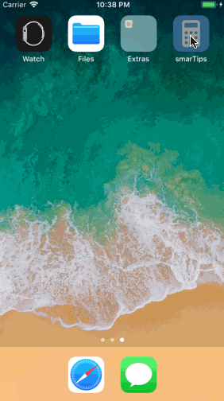

# Pre-work - *SmarTips*

**SmarTips** is a tip calculator application for iOS.

Submitted by: **Jie Lan**

Time spent: **30** hours spent in total

## User Stories

The following **required** functionality is complete:

* User can enter a bill amount, choose a tip percentage and people, and see the tip, each and total values.

The following **optional** features are implemented:

*  Settings page to change the default tip percentage.
*  Add a light/dark color theme to the settings page. 
*  Remembering the bill amount across app restarts (if <10mins)
*  Using locale-specific currency and currency thousands separators.
*  Making sure the keyboard is always visible and the bill amount is always the first responder. This way the user doesn't have to tap anywhere to use this app. Just launch the app and start typing.
*  Improve the UI design with different custom icons.
*  add UI animation:a damping infomarion view

The following **additional** features are implemented:

*  An update button links to the app store.
*  Create an app icon and lauching screen

## Video Walkthrough 

Here's a walkthrough of implemented user stories:

GIF created with [LiceCap](http://www.cockos.com/licecap/).

## Notes

Describe any challenges encountered while building the app.
* I never learn swift before, so I have to start learning swift from beginning in a short time.
* When I try to develop the UI of the app, I need to use photoshop, which looks like is not a computer science field.

## License

    Copyright [Jie Lan] [name of copyright owner]

    Licensed under the Apache License, Version 2.0 (the "License");
    you may not use this file except in compliance with the License.
    You may obtain a copy of the License at

        http://www.apache.org/licenses/LICENSE-2.0

    Unless required by applicable law or agreed to in writing, software
    distributed under the License is distributed on an "AS IS" BASIS,
    WITHOUT WARRANTIES OR CONDITIONS OF ANY KIND, either express or implied.
    See the License for the specific language governing permissions and
    limitations under the License.
